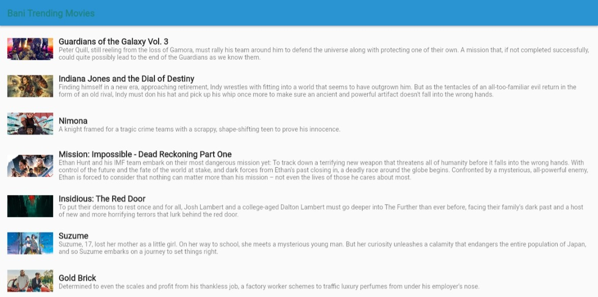

# Flutter API
Ini adalah proyek UAS Pemrograman Mobile yang menggabungkan penggunaan API dengan Flutter untuk membuat aplikasi mobile. Dalam proyek ini, saya akan menggunakan Flutter untuk mengonsumsi dan menampilkan data dari API yang tersedia.

## Instalasi
1. Pastikan Anda telah menginstal Flutter SDK. Jika belum, Anda dapat mengunjungi flutter.dev untuk petunjuk instalasi.
2. Clone repositori ini ke dalam direktori lokal Anda:
   ```shell
   git clone https://github.com/nama-pengguna/repo-api-flutter.git
   ```
4. Masuk ke direktori proyek:
   ```shell
   cd repo-api-flutter
   ```
6. Jalankan perintah berikut untuk menginstal dependensi yang diperlukan:
   ```shell
   flutter pub get
   ```
8. API yang saya gunakan adalah `https://www.themoviedb.org/movie`

## Contoh Penggunaan

